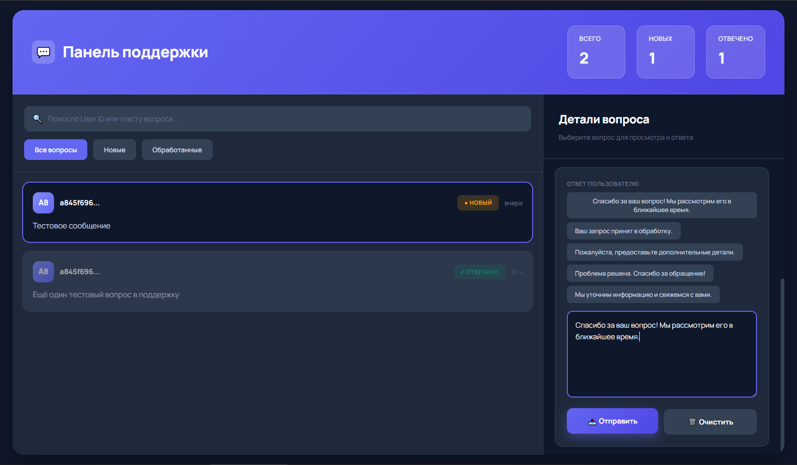

# AssetTracker (Telegram-bot)
Телеграм бот **демо-счет** криптовалютной биржи. CRUD операции над активами, просмотр статистики по активам, торговля с нейросетью и возможность писать в поддержку с дальнейшей обработкой этих вопросов администратором через защищенный Spring Security сайт.

подробнее
  

.  
* **Full CRUD управление портфелем:**  
Пользователь может гибко управлять своими активами в режиме реального времени.
* **Интеллектуальный помощник:**  
Интеграция с нейросетью для анализа рынка и принятия торговых решений.
* **Система Helpdesk:**  
Двусторонняя связь с администратором. Вопросы пользователей попадают в защищенный бэк-офис для обработки модератором.
* **DevOps-ready:**  
Проект спроектирован по принципу Cloud Native и готов к деплою в любую среду. Инструкция по запуску намеренно опущена, так как работа приложения завязана на внешние платные API. Однако наличие Dockerfile, docker-compose.yml и тестов на TestContainers позволяет убедиться в корректности сборки и интеграции компонентов без фактического наличия ключей.
* **Quality Assurance:**  
Стабильность кода подтверждена Unit-тестами и интеграционным тестированием с использованием TestContainers для эмуляции реальной среды базы данных. Тестируется security, а также async части.

## ⚙Технологии
### приложение
- Spring Boot (Security, Web, Data, Cache)
- PostgreSQL
- Redis
- Docker
- MapStruct
- Lombok
- TelegramBots
### тесты
- JUnit
- Mockito
- TestContainers
- Liquibase
- Awaitility

## Панель администратора

>Панель для обработки пользовательских вопросов или жалоб, ответ сразу отправляется нужному пользователю в чат. Реализован поиск всех вопросов какого-то юзера по его ID или по содержанию.

✅ Сайт защищен через Spring Security не только на уровне URL, но и на уровне методов.  
✅ Реализована защита от CSRF  

## Телеграм Бот

 
 
 
 
 
>Это не все возможности бота, например для удобства я не показал профиль, меню для написания вопроса в поддержку, меню ввода количества монет, меню для некорректного добавления/удаления/обновления монеты (например пользователь обновляет монету которой у него нет), а также пример ответа от нейросети, но основные возможности бота были продемонстрированы.  

### Технические аспекты и архитектура
- **Событийно-ориентированная архитектура:**  
Бот реализован на базе Long-polling с многопоточной обработкой обновлений. Внедрена кастомная система идентификации действий: каждое событие инкапсулируется в Event и передается специализированным хендлерам (Button/Message Handlers), что обеспечивает слабую связность компонентов.
- **Финансовая точность:**  
Все операции с балансами и котировками реализованы через BigDecimal с соблюдением стандартов точности для финтех-приложений, что исключает ошибки округления при расчетах.
- **Интеграция с Redis и отказоустойчивость:**  
Реализована стратегия Graceful Degradation: при сбое кэша приложение сохраняет работоспособность, переключаясь на резервные механизмы.
- **Безопасность и администрирование:**  
Доступ к панели управления поддержкой защищен Spring Security включая CSRF защиту. Все чувствительные данные (API-ключи, учетные данные БД) вынесены в переменные окружения, работа с которыми стандартизирована через .env.example.
- **Контроль ресурсов и внешних API:**  
Для защиты от перегрузок и оптимизации затрат на AI-интеграции внедрен Rate Limiter.
- **Чистый код и логирование:**  
Использован AOP (Aspect-Oriented Programming) для реализации сквозной логики логирования и мониторинга, что позволило освободить бизнес-логику от побочного кода.
